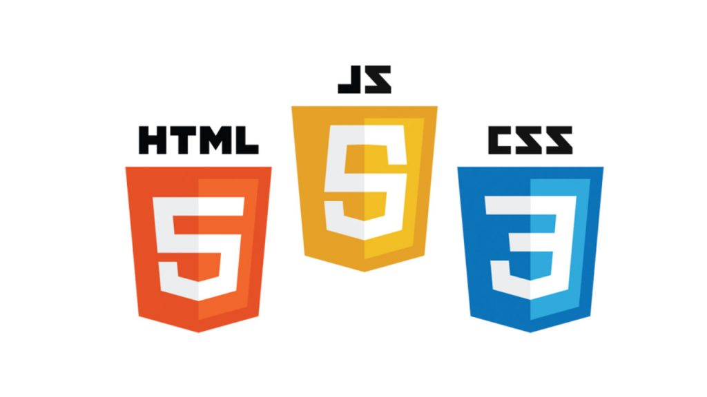

## Marco Uriel Pérez Gutiérrez 
### Wed Development and Software Development
- I am currently studying Software Engineering at Tec de Monterrey, located in Mexico City
- My main topics are Web Development, Software Development and Artifial Intelligence
- You can contact me at mupgutierrez@gmail.com :)
- My LikedIn is https://www.linkedin.com/in/marco-p%C3%A9rez-guti%C3%A9rrez-98604b202/?locale=en_US 

#### In my github you will find projects of Web Development, created with HTML, CSS, BOOTSTRAP, DJANGO and SQLlite.
#### Also you will find projects of software development created with Python, C++ or C#.

